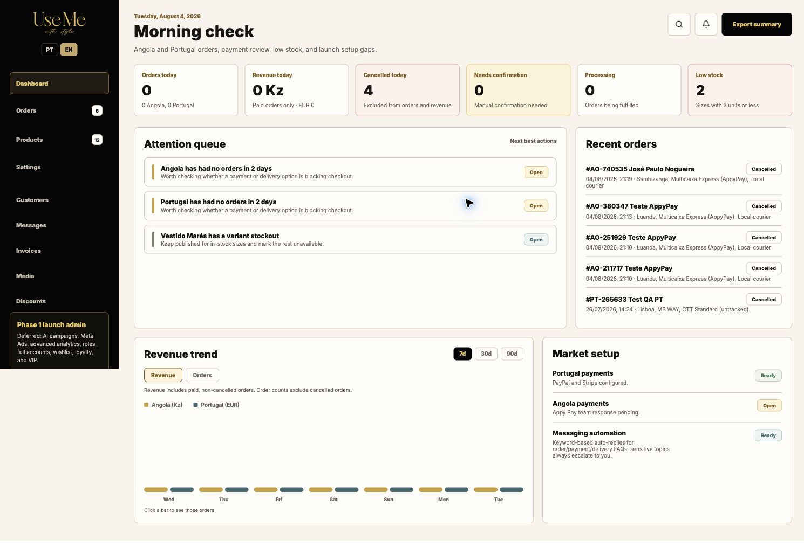
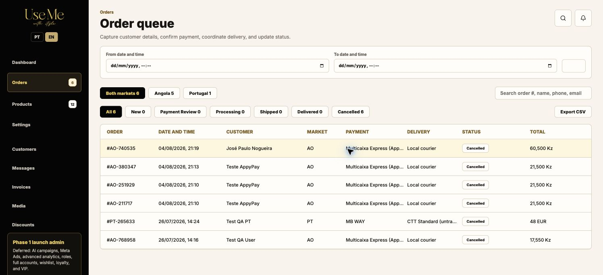
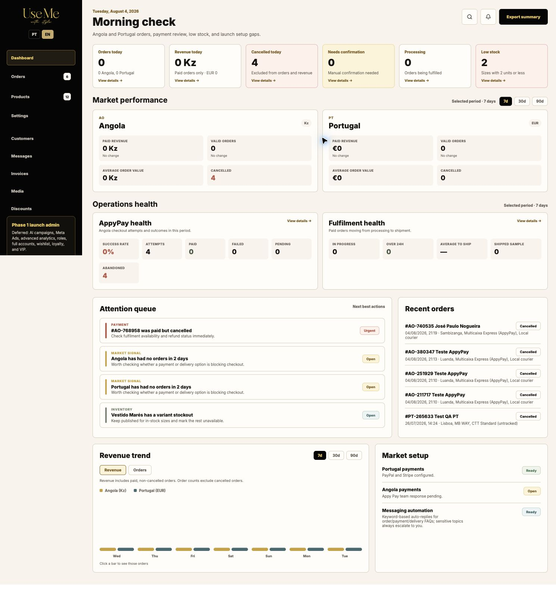
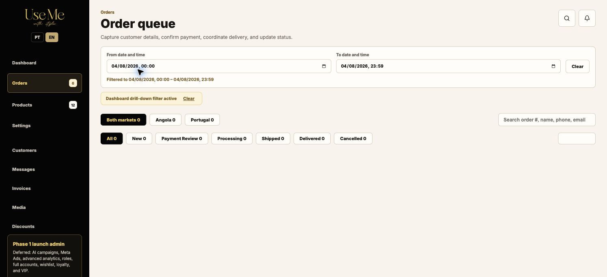
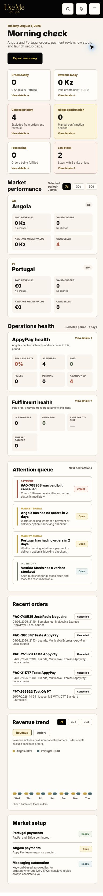

# Dashboard UX and operations audit - 4 August 2026

## Scope

Authenticated storefront admin dashboard and its orders drill-down. The user goal is to understand today's valid business activity, see operational risks, and reach the exact records behind every metric.

## Step 1 - Original dashboard

Health: needs improvement.

- The corrected cancelled-order totals were accurate, but sales, setup, recent activity and attention signals competed at the same level.
- Metric cards were not actionable.
- AppyPay abandonment and fulfilment health were not visible.
- Angola and Portugal performance remained mixed across currencies.

## Step 2 - Original orders queue

Health: generally healthy.

- Date and time were visible and the exact timeframe controls worked.
- Dashboard-originated filters were not yet explicit.
- Dashboard cards could not open a matching filtered queue.

## Step 3 - Improved dashboard

Health: healthy.

- Every headline metric links to a matching queue or catalogue filter.
- Market performance separates AO/Kz and PT/EUR and shows paid revenue, valid orders, AOV and cancellations.
- AppyPay health separates attempts, success, gateway failure, pending and abandoned attempts.
- Fulfilment health surfaces active work, 24-hour SLA breaches and average time to ship.
- Attention items are categorized as Payment, Fulfilment, Inventory or Market signal.
- A paid-but-cancelled order is elevated as an urgent refund/availability risk.

## Step 4 - Metric drill-down

Health: healthy.

- The selected calendar/time window is visible.
- A dashboard context banner explains the metric definition without hiding underlying activity.
- The Orders today view includes all four cancelled orders from the selected day; those records remain excluded from the headline order count.
- Revenue and market drill-downs likewise retain cancelled records for auditability while paid, non-cancelled orders alone contribute to revenue.

## Step 5 - Mobile dashboard

Health: healthy.

- Cards reflow without horizontal clipping.
- Market and operations panels remain readable.
- Attention actions and recent-order statuses retain clear hierarchy.
- The page is intentionally long because operational sections stack; the most urgent summary remains first.

## Accessibility evidence and limits

- Confirmed from rendered DOM: semantic level-two section headings, pressed state on period controls, link semantics on metrics, visible filter labels, an alert role for invalid date ranges, and keyboard-reachable drill-downs.
- Confirmed visually: readable contrast, no clipped mobile content, and visible status differentiation that does not rely only on color.
- Not fully verified: screen-reader announcements, complete keyboard traversal, zoom above 100%, and contrast ratios measured programmatically.
